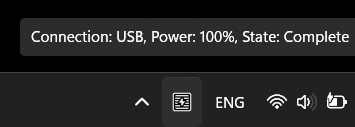
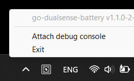

# go-dualsense-battery

## Description

A small Windows taskbar application, written in Go, for showing the battery level
of a PlayStation 5 DualSense controller connected over BlueTooth or USB.

Supports a single controller, the first one in the device list.
Last tested with controller firmware A-0520 on Windows 11 Pro 64bit 10.0.26100.2605.

## How it works

- Every few seconds the applications opens a DualSense controller Windows device
and reads its status and battery level.
- It shows different battery level icons depending if it's being connected
over USB (charging), BlueTooth or if no devices are found.
- It prints what it's doing as a tooltip over the taskbar icon.
- It consumes a couple of MB of RAM and a tiny amount of CPU cycles.
- You can right click and `Exit` at any time.

## Installing

- Download a 64bit binary release (`go-dualsense-battery.exe`) somewhere on disk
from the [Releases](https://github.com/neolit123/go-dualsense-battery/releases) page.
- Press `Win+R` and type `shell:startup`. This will open the `Startup` folder in Explorer.
- Create a shortcut of the executable in this folder to start it with Windows.

## Dependencies

- http://github.com/getlantern/systray
  - Used for managing the Windows taskbar application.
- http://github.com/sstallion/go-hid
  - Windows HID (Human Interface Device) bindings for Go,
  so that this app can talk to the controller. Requires CGO.

## Building

- Install a [MinGW toolchain](https://www.mingw-w64.org).
For example [w64devkit](https://github.com/skeeto/w64devkit).
- Install a [Go toolchain](https://go.dev/doc/install).
- Install [`go-winres`](https://github.com/tc-hib/go-winres).
For generating a resource file and adding an application icon.
- Run `build.cmd`. What it does is:
  - Sets `CGO_ENABLED=1`.
  - Gets the application version from a `git` tag.
  - Generates resources with `go-winres`.
  - Builds a Windows GUI application.

## License

Apache 2.0. See the [LICENSE](./LICENSE) file.

## Icons and art

Authored by me (neolit123) using Clip Studio Paint 1.x.
The art license is the same as the project [LICENSE](./LICENSE).

## Acknowledgements

Examined the source code of the following projects while figuring out how to approach the
reading of device status:

- https://github.com/Ohjurot/DualSense-Windows
- https://github.com/filipmachalowski/TraySense
- https://github.com/nondebug/dualsense
- https://controllers.fandom.com/wiki/Sony_DualSense
